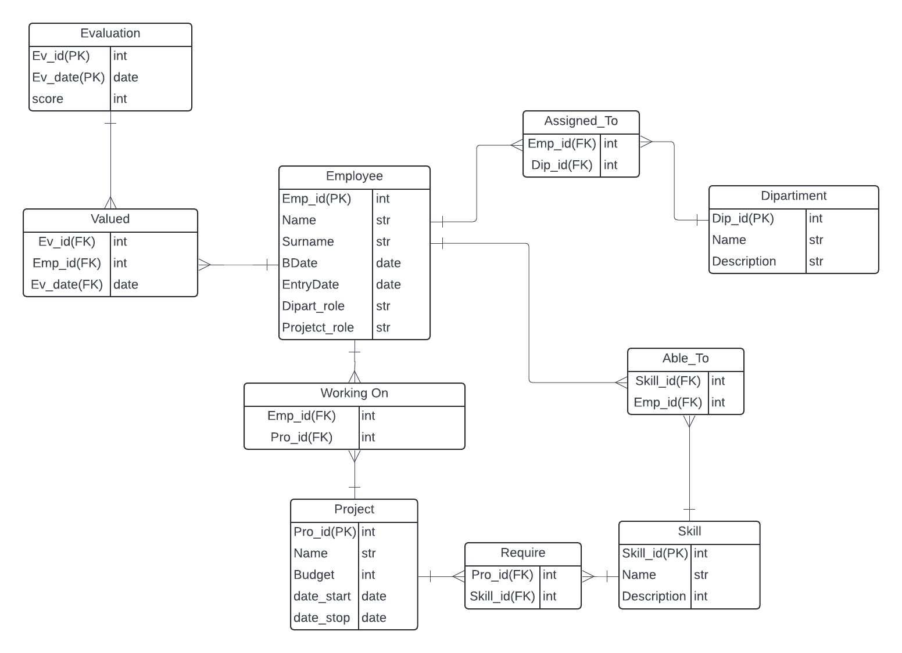

# Human Resources Management dB

## Description
This project is a sql database which can be utilized to manage the human resources inside a generic agenzy. We supposed there to have a software development agency including employees such as project managers, design sepialists and others.
All of the instrments adopted are free to use and to consult. We also point out 'Lucidchart' for the Entity-Relation schema above.

## DataBase scheme

## Config
1. Create tables using the script `HRM_dB.sql`. Be aware that, if you are yousing MOngoDB for example, a database is automatically created in the first cript lines. If you are incurring in this type of error, remove those lines for 'CREATE dB' and 'USE dB'.
2. Populate the database with examples I wrote using the script `UPDATE_query.sql`.
3. Execute the queries on `int_queries.sql` to obtain key informations. Note that I wrote a short queries interpretation on docs/ to help you read the results.

## Key Queries
- Set out Employees, adding their Departements and various projects their working on.
- Specific skills regarding a specific Employee.
- Evaluated Employees in a given period of time.
- Total Budget set for Projects according to a certain Departement.
- Projects that require a specific skill by an Employee.
